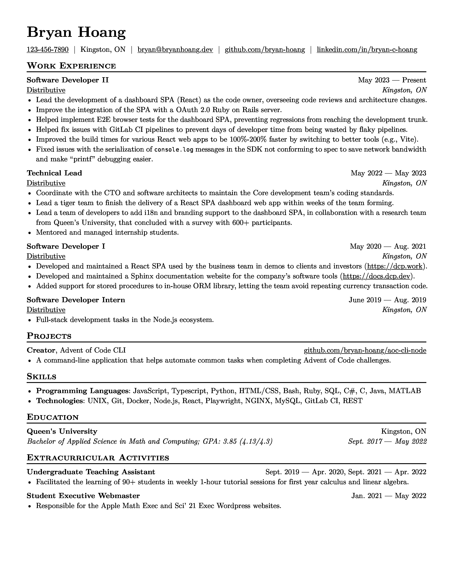

# resume

[](https://github.com/bryan-hoang/resume/actions/workflows/ci.yml)
[](https://github.com/RichardLitt/standard-readme)

My resume, written in Typst!

## Install

Prerequisites:

- [Typst](https://github.com/typst/typst#installation)

Steps:

```console
git clone https://github.com/bryan-hoang/resume.git
cd resume
typst compile resume.typ
```

## Usage

To make tailoring the resume for specific sectors easier, I set the
`TARGET_SECTORS` environment variable when compiling the document to include
additional elements. It's a comma separate list. e.g.,

```console
TARGET_SECTORS=ai,education typst compile resume.typ
```

## Preview

With `TARGET_SECTORS` being unset:



To see the latest version of the resume as a PDF, download it from the artifacts
of the
[latest CI job](https://github.com/bryan-hoang/resume/actions/workflows/ci.yml?query=branch%3Amain).

## Maintainers

[@bryan-hoang](https://github.com/bryan-hoang)

## Contributing

PRs accepted.

Small note: if editing the README, please conform to the
[standard-readme](https://github.com/RichardLitt/standard-readme) specification.

## License

MIT © 2024 Bryan Hoang
